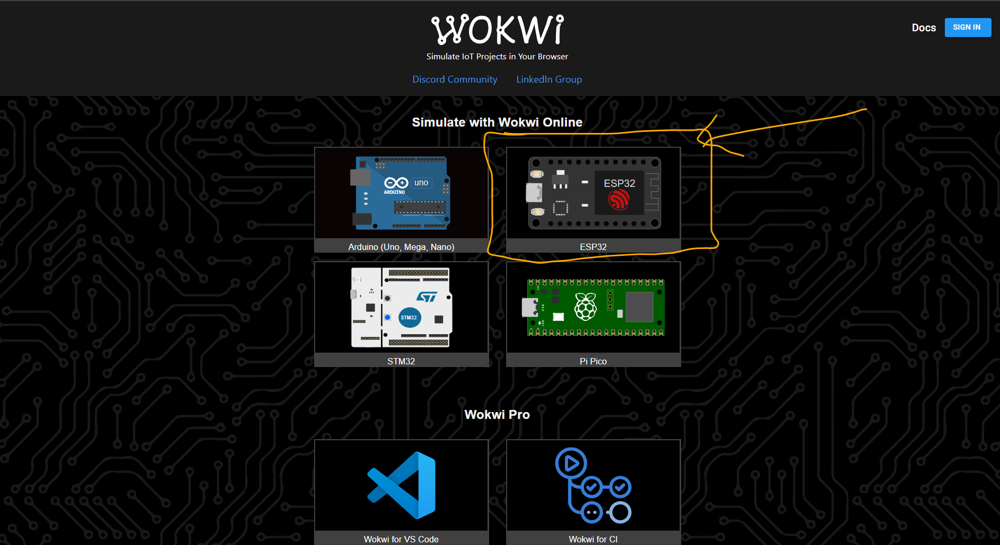
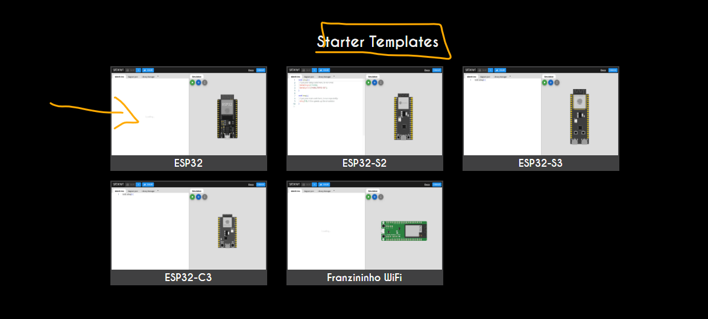
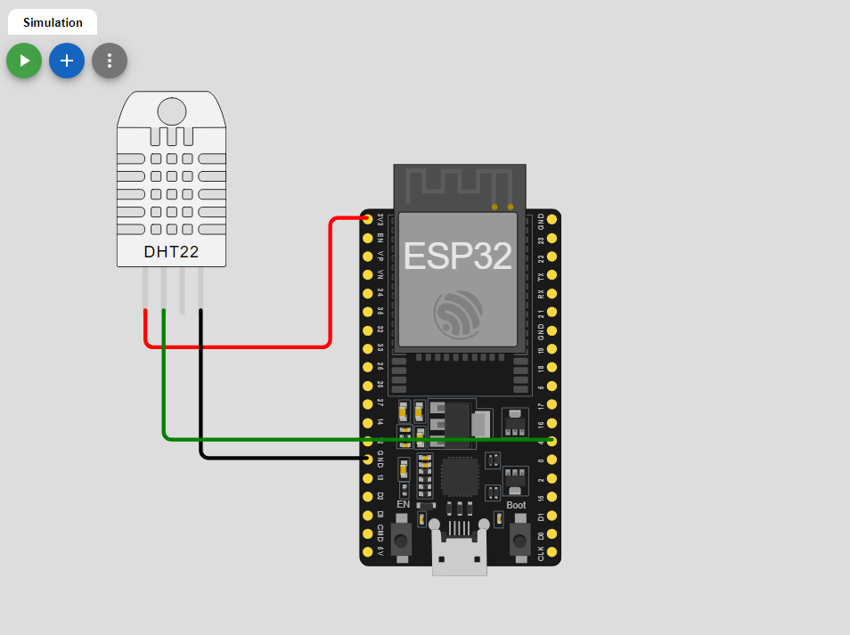
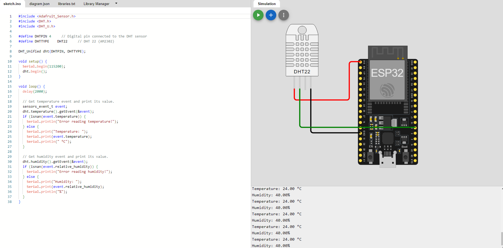

# DHT Project with Wokwi use this link to navigate to wokwi  
 Use this link to access the simulating cloud application - https://wokwi.com/
This is a project that demonstrates how to use the DHT sensor with an ESP32 Board in the Wokwi simulator.

## Board Selection
Select ESP32 baord
 

Navigate and select ESP32 baord as indicated below

Click the add button to add a sensor, in this case search for DHT22

## Circuit Diagram
Do the wiring as shown below

The circuit diagram shows the connections between the DHT sensor and the ESP32 board.

## Code

This section contains the code for the DHT project with Wokwi, located in the `src` folder.
## Complete project

